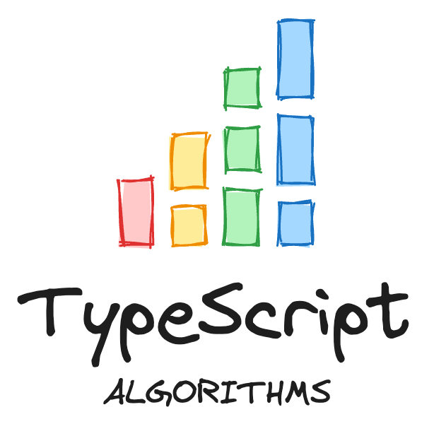

  

---

Algorithms and data structures implemented in TypeScript.

## Getting Started

-   Install [Node Version Manager](https://github.com/nvm-sh/nvm)
-   `yarn setup`
-   `yarn test --all`

## Commands

| Command                               | Description                         |
| ------------------------------------- | ----------------------------------- |
| `yarn setup`                          | Setup local development environment |
| `yarn test`                           | Run tests                           |
| `yarn test --all`                     | Run all tests                       |
| `yarn test --watch`                   | Watch tests                         |
| `yarn generate:leetcode-problem`      | Generate new LeetCode problem       |
| `yarn generate:project-euler-problem` | Generate new Project Euler problem  |

## Appendix

-   [LeetCode](https://leetcode.com)
-   [Project Euler](https://projecteuler.net)
-   [The Algorithm Design Manual](https://www.algorist.com)
