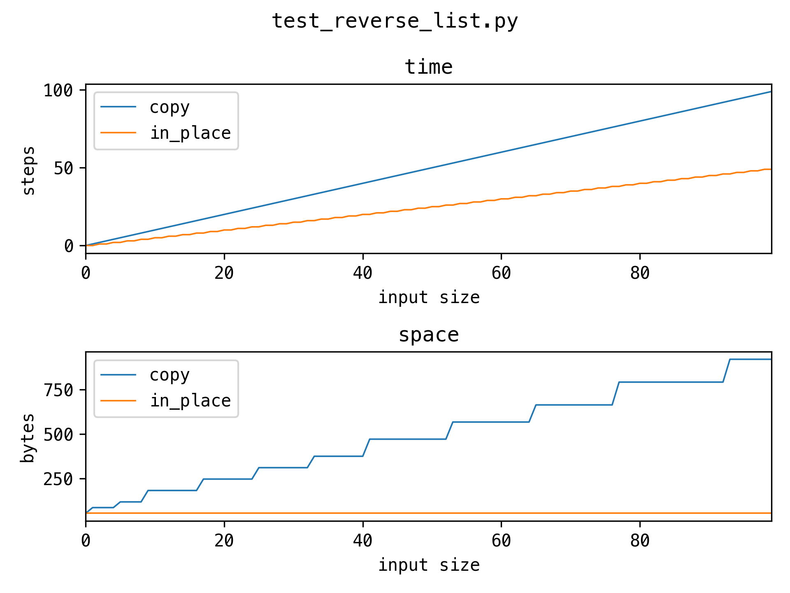
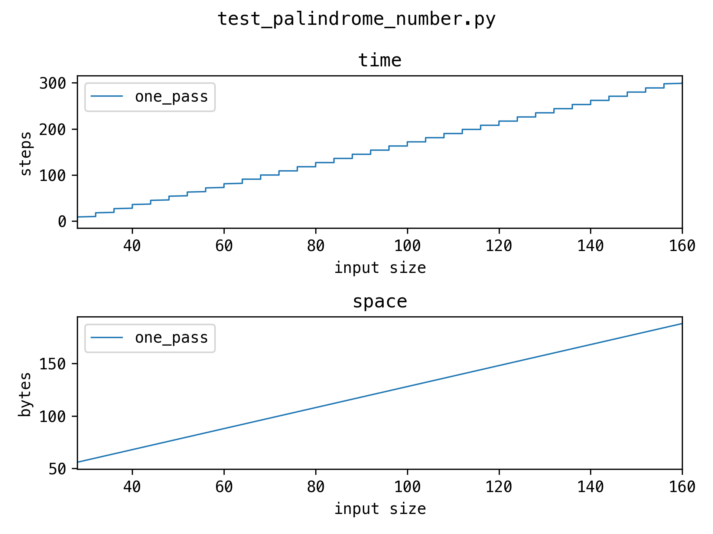

# Algorithm Notebook

Algorithms and data structures notes ([PDF](book/output/book.pdf)).

## Development

- Install [Homebrew](https://brew.sh)
- `make install`
- `make test`

## Plots

| Problem           | Big O                                        |
| ----------------- | -------------------------------------------- |
| two sum           |            |
| reverse list      |       |
| palindrome number |  |
